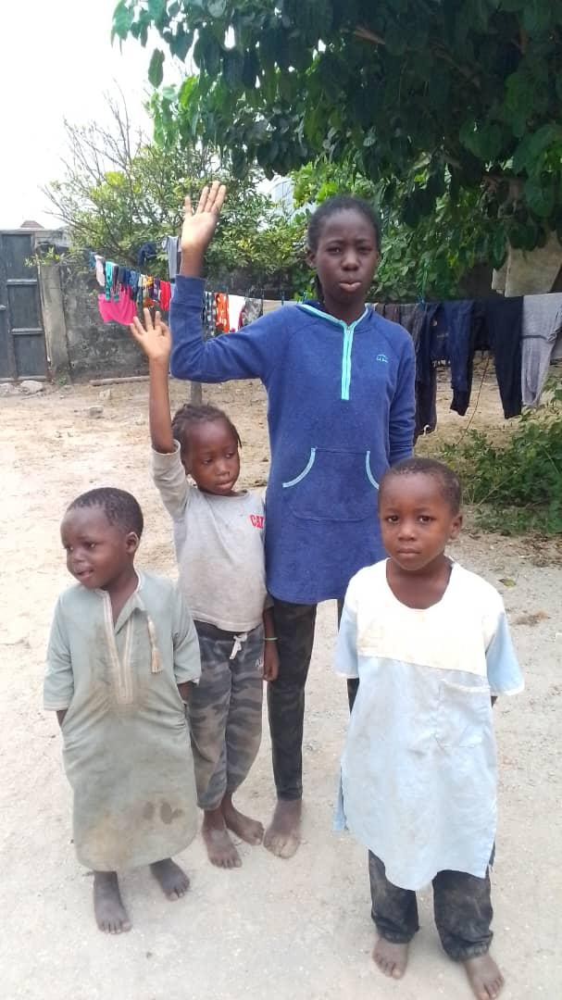
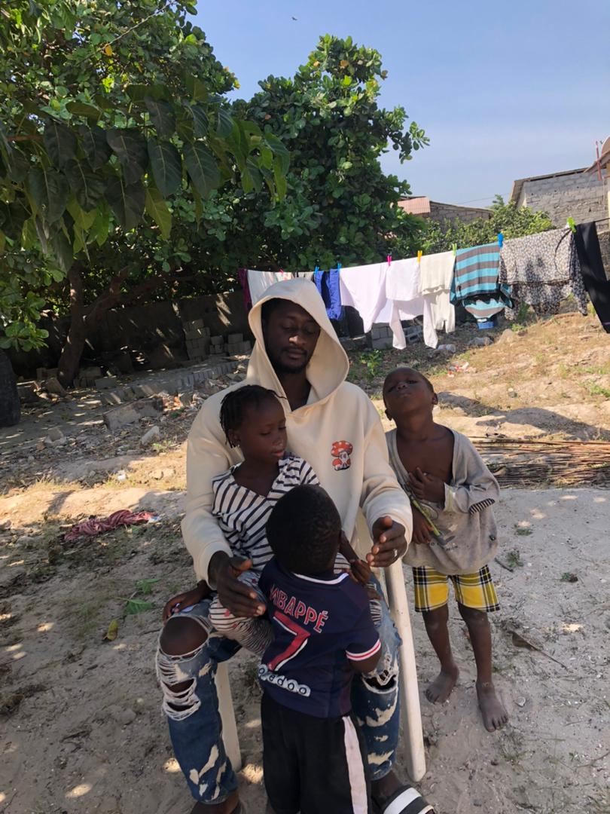
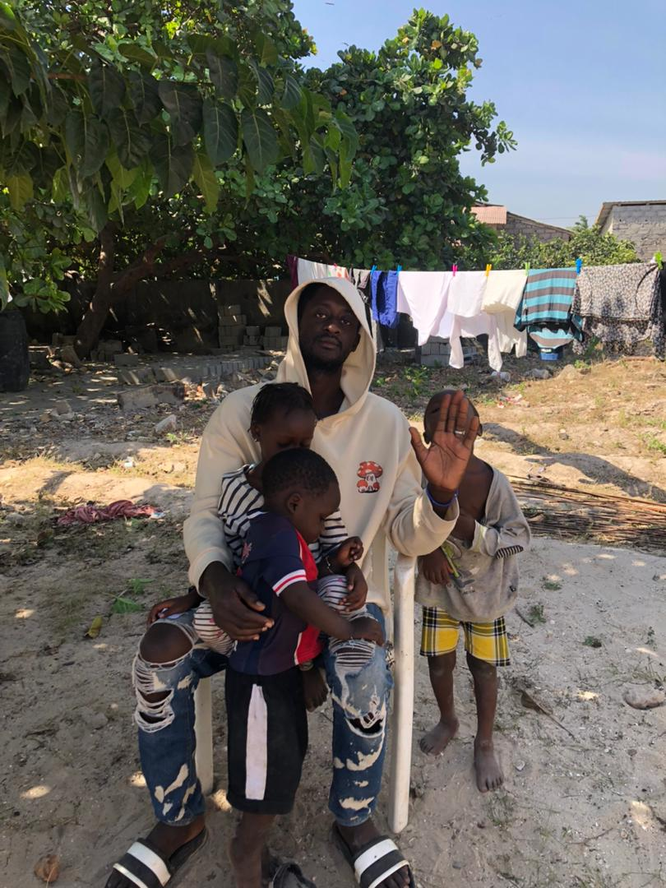
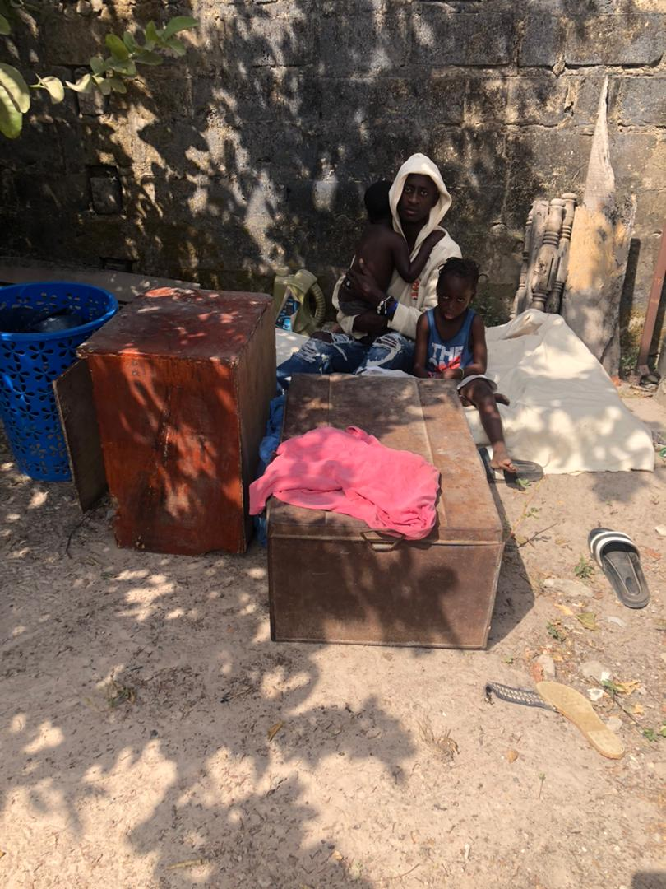
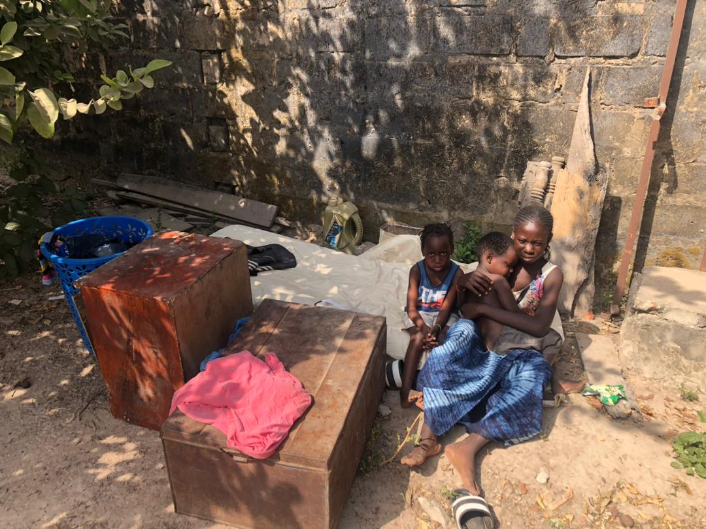

# Epistemological Experiments

## Gameified Altruism

Can you kindly help us buy some food

Here we are facing lot of difficulties here , since my parents passed away through car accident we find it very hard to survive

Oh I understand but please if there is way you can send us any small amount as a helping hand is never small so anything you are able to give from your heart will be helpful as right now we are even homeless

But when we have food this will help a lot

We are all keeping praying and struggling hard for better days to come as life treating us here very badly with so much depression and embarrassment and it has not been easy with us here . Who feels the pain knows . My heart is crying right now

First name : Seedy   
Last name : Manjangy   
Town : Brikamay   
Street: sanneh 1   
Region : western   
Country: The Gambia   
West Africa  
Zip:00220   
Phone:+2207483179   
Bank: zenith bank   

Platform to send : www.remitly.com

Sending method: cash pick up

 
